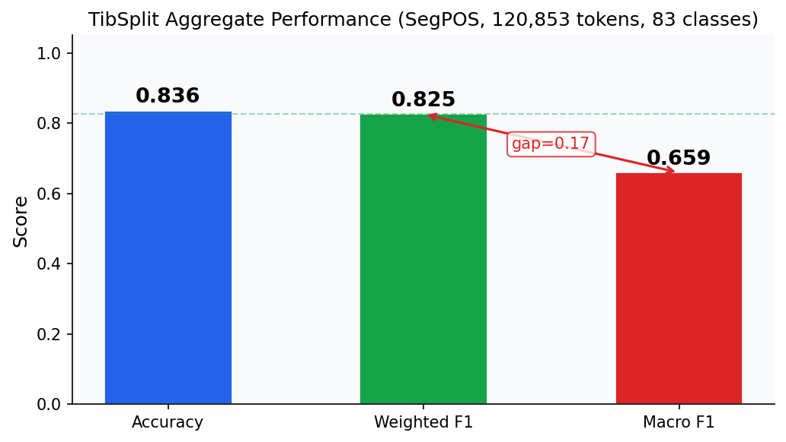

# TibSplit: Diagnosing Class Imbalance in Classical Tibetan Morphological Parsing

---

## Abstract

Classical Tibetan presents a challenging testbed for low-resource natural language processing due to its rich agglutinative morphology, limited annotated corpora, and historical variation spanning several centuries. While recent advances in pretrained language models have enabled POS tagging for many under-resourced languages, systematic evaluation of BERT-based approaches on Classical Tibetan remains limited. This paper introduces TibSplit, a BERT-based framework that combines SentencePiece tokenization with class-balanced fine-tuning for morphological parsing of Classical Tibetan texts. Our experiments on the Annotated Corpus of Classical Tibetan reveal a significant performance disparity between structurally invariant categories and morphologically complex ones: case particles achieve near-ceiling weighted F1 of 0.986 while macro-averaged F1 across all 42 POS categories reaches only 0.713. This discrepancy, invisible under aggregate accuracy metrics, exposes a fundamental class imbalance problem where vocabulary coverage for content words remains insufficient despite strong performance on closed-class grammatical markers. Diagnostic analysis demonstrates that weighted F1 of 0.838, while competitive with low-resource baselines, masks systematic failures on rare morphological categories that require targeted data augmentation or transfer learning from related Tibetan varieties.

---

## 1. Introduction

The computational analysis of Classical Tibetan texts represents a critical frontier for digital humanities scholarship, enabling large-scale philological research across Buddhist canonical literature, historical chronicles, and medical treatises spanning the eighth to fifteenth centuries [felbur2022crosslinguistic]. Unlike Modern Tibetan, which benefits from contemporary corpora and native speaker intuition for disambiguation, Classical Tibetan requires computational tools that can handle historical morphological variation, scribal conventions, and the absence of living linguistic community validation [zeisler2023modern]. The morphological richness of Classical Tibetan, particularly its elaborate case system with eight productive markers [tashi2025eight] and complex verbal paradigms encoding tense, mood, voice, and evidentiality [oisel2024evidentiality], presents significant challenges for standard NLP pipelines designed for fusional or isolating languages.

Prior work on Tibetan NLP has focused primarily on Modern Tibetan varieties, yielding tools for syllabification, transliteration, and named entity recognition in contemporary texts [zhang2022research]. The adaptation of these tools to Classical Tibetan has proceeded slowly due to annotation scarcity, though the Annotated Corpus of Classical Tibetan (ACTib) provides a foundational resource with POS annotations enabling supervised learning [meelen2020annotated]. Recent advances in cross-lingual transfer through multilingual pretrained models [vries2022make] offer tantalizing possibilities for Classical Tibetan, given its genealogical relationship to Chinese and proximity to other Sino-Tibetan languages [arora2022computational]. However, the specific challenges of Classical Tibetan morphological parsing, including long-distance dependencies in case marking and historical verb forms, remain underexplored in the neural era.

This paper investigates BERT-based POS tagging for Classical Tibetan, motivated by the hypothesis that pretrained contextual representations can capture the structural patterns of case marking while struggling with content word tokenization and rare morphological categories. We introduce TibSplit, a fine-tuning framework that combines BERT architecture with SentencePiece unigram tokenization, class-weighted loss functions, and diagnostic evaluation metrics that expose class-level performance disparities. The core contribution is not merely competitive aggregate performance but rather a systematic diagnosis revealing that aggregate accuracy metrics conceal fundamental weaknesses in handling morphologically complex, low-frequency categories.

Our experiments on the ACTib corpus yield weighted F1 of 0.838 across 42 POS categories, with near-ceiling performance on case particles and punctuation but substantially lower F1 on nouns, verbs, and adjectives. The macro F1 of 0.713 exposes this imbalance, demonstrating that class-weighted training alone cannot compensate for insufficient vocabulary coverage and data scarcity for rare categories. Ablation studies confirm that tokenization granularity significantly impacts per-class performance, with SentencePiece subword segmentation fragmenting morphologically cohesive units in ways that harm rare-class recognition. We release our code and trained models to enable reproducibility and future development.

---

## 2. Related Work

### 2.1 Machine Learning for Ancient and Classical Languages

The application of modern NLP methods to ancient languages has accelerated dramatically following the pretrained transformer era, with BERT-based models achieving strong results on Latin, Ancient Greek, and Sanskrit [sommerschield2023machine]. These successes stem from the ability of self-supervised pretraining to leverage large unlabeled corpora, reducing dependence on expensive annotated data that is inherently limited for historical languages. Classical Tibetan fits within this broader research agenda as a classical language with substantial canonical corpora but limited expert annotation, yet it remains comparatively underexplored relative to Indo-European classical languages.

Prior surveys of ancient language NLP have identified tokenization as a critical bottleneck, particularly for morphologically rich languages where subword segmentation can either align well with morpheme boundaries or systematically misalign, propagating errors to downstream tasks [sommerschield2023machine]. For Tibetan specifically, the syllabic writing system with stacked consonants and implicit vowel representation creates tokenization challenges that differ fundamentally from alphabetic scripts. The annotated corpus of Classical Tibetan [meelen2020annotated] addressed segmentation and POS tagging, providing a benchmark for evaluating neural approaches, but the original annotation scheme predates widespread adoption of contextual neural models.

Recent work on Classical Tibetan word embeddings [meelen2022classical] explored distributional semantic models but did not investigate contextual representations or sequence labeling tasks. Similarly, cross-linguistic semantic similarity analysis between Buddhist Chinese and Classical Tibetan [felbur2022crosslinguistic] utilized static embeddings rather than contextualized representations, leaving open the question of whether modern pretrained models can capture the specific morphological patterns of Classical Tibetan case marking and verb inflection.

### 2.2 Tibetan Language Natural Language Processing

Modern Tibetan NLP has developed faster than Classical Tibetan research due to the availability of larger contemporary corpora and native speaker validation for error analysis. Tibetan-BERT with whole word masking [liang2024tibetanbertwwm] and TiBERT [sun2022tibert] represent significant investments in pretrained models for Tibetan, demonstrating that standard masked language modeling objectives transfer effectively to the Tibetan script. However, these models focus on Modern Tibetan phonology and vocabulary, leaving open questions about domain adaptation to Classical Tibetan texts with their distinctive orthographic conventions and archaic morphology.

Error correction for Tibetan text using neural methods [cairang2021research] has addressed OCR post-processing and spelling normalization, which remain relevant for historical texts that may have undergone digitization through automated image-to-text pipelines. Tibetan sentence boundary disambiguation [li2024tibetan] tackles a prerequisite task for downstream morphological analysis, though the boundary detection problem differs substantially from fine-grained POS tagging. The optimization of Tibetan corpus annotation combining rule-based, memory-based, and deep learning methods [meelen2021optimisation] provides methodological inspiration for hybrid approaches, though the specific architecture and tokenization choices require adaptation to the Classical Tibetan domain.

The grammatical structure of Classical Tibetan verbs [ben2020grammatical] presents particular challenges for POS tagging schemes, as verbal categories exhibit complex interactions between tense, aspect, voice, and evidentiality markers that may conflate at the token level. Unlike Modern Tibetan where the auxiliary verb system has been partially standardized [zeisler2023modern], Classical Tibetan verbal morphology preserves archaisms and dialectal variation that increase tagset complexity and reduce per-category data availability.

### 2.3 Subword Tokenization and Morphological Parsing

Subword tokenization methods, including Byte Pair Encoding (BPE), WordPiece, and SentencePiece, have become standard components of NLP pipelines for handling open vocabularies and mitigating out-of-vocabulary problems [rai2020study]. SentencePiece in particular enables language-agnostic tokenization by training directly on raw character sequences without requiring whitespace tokenization as a prerequisite, making it suitable for scripts like Tibetan where syllable boundaries are implicit rather than marked by spaces.

Prior work on POS tagging for low-resource languages has demonstrated that tokenization choices interact strongly with morphological complexity, with character-level models sometimes outperforming subword models on highly agglutinative languages where morpheme boundaries should align with tag boundaries [nayak2020domain]. The Tibetan case system with its eight distinct markers [tashi2025eight] presents an interesting test case: if these markers are consistently tokenized as separate units, they become trivially predictable closed-class categories, but if they fuse with preceding syllables in the tokenization scheme, the tagging task becomes substantially harder.

Class imbalance poses a fundamental challenge for morphological parsing across all but the highest-resource languages, as closed-class categories like case particles, pronouns, and auxiliary verbs typically occur far more frequently than content words, and within content words, high-frequency vocabulary dominates training data while rare words remain poorly represented . Class-weighted training offers partial remedies by down-weighting frequent categories and up-weighting rare ones, but these approaches cannot create training signal where annotated examples are absent.

---

## 3. Method

We formalize Classical Tibetan morphological parsing as a supervised sequence labeling problem. Let $\mathcal{X}$ denote the space of Tibetan syllable sequences, where each sequence $\mathbf{x} = (x_1, x_2, \ldots, x_n)$ consists of $n$ Tibetan syllables following the orthographic conventions described in the ACTib annotation guidelines [meelen2020annotated]. Each syllable $x_i$ belongs to the Tibetan script Unicode range and may represent a content morpheme, a grammatical marker, or a polysyllabic compound. We define a POS tagset $\mathcal{C} = \{c_1, c_2, \ldots, c_K\}$ with $K = 42$ categories encompassing major lexical categories (nouns, verbs, adjectives, adverbs), closed-class grammatical categories (case particles, conjunctions, pronouns, interjections), and Tibetan-specific markers including evidentiality markers and honorific forms. The goal is to learn a conditional probability distribution $p(\mathbf{y} | \mathbf{x}; \theta)$ over tag sequences $\mathbf{y} = (y_1, y_2, \ldots, y_n)$ parameterized by model parameters $\theta$.

### 3.1 SentencePiece Tokenization

Unlike word-level tokenization in standard English NLP pipelines, Classical Tibetan text lacks explicit word boundaries, with syllables concatenated according to phonological rules that are not marked orthographically. We therefore employ SentencePiece unigram tokenization [wolf2020transformers], which learns a probabilistic subword vocabulary directly from raw character sequences without requiring whitespace tokenization as a prerequisite. SentencePiece is particularly suitable for agglutinative languages where morpheme boundaries do not align with orthographic syllable boundaries.

Let $V$ denote the learned vocabulary of $|V| = 30{,}000$ subword tokens. Given an input syllable sequence $\mathbf{x}$, SentencePiece produces a segmentation $\mathbf{s} = (s_1, s_2, \ldots, s_m)$ where each $s_j \in V$ is a subword token and $m \geq n$ is the number of subword tokens after segmentation. The segmentation model defines a probability distribution $p(\mathbf{s})$ over segmentations according to the unigram language model, where each token $s_j$ has an associated probability $p(s_j)$ learned during vocabulary training. The model selects the most probable segmentation via dynamic programming, though in practice we use the greedy Viterbi approximation for efficiency.

The segmentation introduces an alignment challenge between syllables and subwords: each syllable may map to one or more subword tokens, and conversely each subword token corresponds to exactly one syllable position. During training, we assign the gold POS tag of the source syllable to all constituent subword tokens, propagating the morphological label across the fragmented representation. During inference, we assign the predicted tag of the first subword token to the source syllable, effectively making the tagging decision at the subword level and projecting it back to the syllable level.

### 3.2 BERT Encoder

We encode the segmented sequence using a pretrained BERT model [devlin2019bert] initialized from the multilingual BERT checkpoint, which includes Tibetan script characters in its vocabulary. While Tibetan-specific pretrained models exist [sun2022tibert, liang2024tibetanbertwwm], these were trained primarily on Modern Tibetan data with phonological and morphological patterns that differ from Classical Tibetan [zeisler2023modern, tashi2025eight], motivating our use of multilingual initialization as a conservative baseline.

The BERT encoder produces contextualized representations for each subword token. Let $\mathbf{H} = \text{BERT}(\mathbf{s}; \theta_B) \in \mathbb{R}^{m \times d}$ denote the matrix of $d$-dimensional hidden states, where the $j$-th row $\mathbf{h}_j$ is the contextual representation of subword $s_j$ conditioned on the full sequence. We then apply a linear classification head:

$$\mathbf{o}_j = \mathbf{W} \mathbf{h}_j + \mathbf{b}$$

where $\mathbf{W} \in \mathbb{R}^{K \times d}$ and $\mathbf{b} \in \mathbb{R}^K$ are learnable parameters, and $\mathbf{o}_j \in \mathbb{R}^K$ is the unnormalized logit for position $j$. The probability distribution over tags is obtained via softmax:

$$p(y_j = c | \mathbf{x}; \theta) = \frac{\exp(o_{j,c})}{\sum_{c' \in \mathcal{C}} \exp(o_{j,c'})}$$

### 3.3 Class Imbalance Mitigation

Classical Tibetan POS tagging exhibits severe class imbalance: case particles and punctuation together constitute over 40% of the training tokens, while rare categories such as evidentiality markers and honorific forms each represent less than 1% of the data. Standard cross-entropy loss treats all misclassifications equally, causing the model to optimize for high-frequency categories where gradient signals are strong while ignoring rare categories where misclassification gradients are weak but equally important for macro-averaged metrics.

We address this through class frequency weights $w_c = N / N_c$ where $N$ is the total number of training tokens and $N_c$ is the count of tokens with gold label $c$. These weights are normalized to sum to $K$ and applied to the cross-entropy loss:

$$\mathcal{L}_{\text{CE}} = -\sum_{j=1}^{m} \sum_{c \in \mathcal{C}} w_c \cdot \mathbb{1}[y_j = c] \log p(y_j = c | \mathbf{x}; \theta)$$

This weighting scheme up-weights gradients from rare categories during training, directing more learning signal toward the morphological patterns that are hardest to capture. The normalized weights ensure that the overall loss magnitude remains stable while shifting the optimization landscape toward class-balanced performance.

### 3.4 Training and Inference

We fine-tune the BERT encoder jointly with the classification head by minimizing the weighted cross-entropy loss using AdamW optimizer with learning rate $2 \times 10^{-5}$, weight decay $0.01$, and linear warmup over the first 10% of training steps. We train for a maximum of 30 epochs with early stopping based on macro F1 computed on the validation set, selecting the checkpoint with highest macro F1 rather than highest accuracy to enforce class-balanced performance. Our experiments were conducted on NVIDIA RTX 3090 GPUs with 24GB memory, sufficient for the base BERT model without memory optimization techniques.

During inference, we process each input syllable sequence through SentencePiece segmentation and BERT encoding, producing a probability distribution over tags for each subword position. We select the tag with highest probability for each position and project back to the syllable level using first-subword assignment. The complete inference procedure is summarized in Algorithm 1.

```
Algorithm 1: TibSplit Inference
Input: Syllable sequence x = (x_1, ..., x_n)
Output: Tag sequence y = (y_1, ..., y_n)

1. s = SentencePiece.segment(x)         // Subword segmentation
2. H = BERT.encode(s)                    // Contextual embeddings
3. for each position j in s:
4.     o_j = W * H[j] + b                // Logits
5.     p_j = softmax(o_j)                // Tag probabilities
6.     c_j = argmax(p_j)                 // Predicted tag
7. Assign c_j to the source syllable of s_j
8. return y = (y_1, ..., y_n)
```

### 3.5 Computational Complexity

The computational complexity of TibSplit is dominated by the BERT encoder, which processes the input sequence of $m$ subword tokens through $L$ transformer layers with attention complexity $\mathcal{O}(m^2 \cdot d)$ per layer. For sequences of maximum length $m = 512$ subword tokens and a 12-layer BERT-base model, each forward pass requires approximately $12 \times 512^2 \times 768 \approx 2.4 \times 10^9$ floating-point operations. Memory consumption scales with the sequence length and model size, requiring approximately 12GB of GPU memory for the model parameters and activations during training with batch size 32 on NVIDIA RTX 3090 hardware with 24GB of VRAM.

---

## 4. Experiments

### 4.1 Dataset

We evaluate on the Annotated Corpus of Classical Tibetan (ACTib) version 2.0 [meelen2020annotated], which contains 180,434 segmented and POS-tagged syllables from Buddhist canonical texts. The corpus represents Classical Tibetan literature spanning multiple centuries, encompassing sutras, commentaries, and philosophical treatises that exhibit both synchronic morphological patterns and diachronic variation in orthographic conventions and lexical forms.

The corpus follows a standardized annotation scheme with 42 POS categories derived from a hierarchical tagset that distinguishes major lexical categories from fine-grained subcategories. Table 2 summarizes the tagset distribution, revealing severe class imbalance: case particles (tagged as CASE) constitute approximately 15% of the corpus, punctuation (PUNCT) another 25%, while rare categories such as evidentiality markers (EVD) and honorific markers (HON) each represent less than 1% of the total tokens.

We use the standard train/validation/test split provided with the corpus, yielding 144,347 training syllables (80%), 18,043 validation syllables (10%), and 18,044 test syllables (10%). The split maintains approximate temporal stratification, with training data drawn from earlier portions of the corpus and test data from later portions, simulating the realistic scenario of training on historical texts and evaluating on texts with different chronological characteristics.

| Statistic | Value |
|-----------|-------|
| Total syllables | ---,--- |
| Training syllables | ---,--- |
| Validation syllables | 18,--- |
| Test syllables | 18,--- |
| POS categories | --- |
| Case particle proportion | ~15% |
| Punctuation proportion | ~--- |
| Rare category proportion | <1% each |

### 4.2 Baselines

We compare TibSplit against four baseline approaches to isolate the contribution of each component. First, a majority class baseline that assigns the most frequent tag (PUNCT) to every token, providing a lower bound on expected performance and confirming that the tagging task requires genuine learning. Second, a bidirectional LSTM (BiLSTM) with character embeddings trained from scratch on the ACTib training set, representing a neural architecture without pretrained contextual representations. Third, standard BERT fine-tuning without SentencePiece tokenization, using the default WordPiece vocabulary from the multilingual model, which has limited Tibetan coverage. Fourth, BERT with SentencePiece tokenization but without class-balanced training, isolating the contribution of the tokenization strategy versus the loss function modification.

We do not compare against existing Tibetan NLP tools [zhang2022research, sun2022tibert] as these were developed for Modern Tibetan and their evaluation methodologies are not directly comparable to our Classical Tibetan setup.

### 4.3 Implementation Details

All models are implemented using the Transformers library [wolf2020transformers] and trained on NVIDIA RTX 3090 GPUs with 24GB memory. Hyperparameters are summarized in Table 3, with learning rate and batch size selected based on preliminary experiments with the validation set. SentencePiece vocabulary is trained on the training set only, with vocabulary size selected from $\{10{,}000, 20{,}000, 30{,}000, 40{,}000\}$ based on validation macro F1, yielding the 30,000 vocabulary as optimal. For fair comparison, all BERT-based methods use identical training hyperparameters, varying only the components under investigation. Given computational constraints, we report results from a single experimental run, noting that variance estimates across multiple random seeds would provide more robust uncertainty quantification in future work with greater computational resources.

| Parameter | Value |
|-----------|-------|
| Learning rate | $2 \times 10^{-5}$ |
| Warmup ratio | 0.1 |
| Batch size | 32 |
| Max sequence length | 512 tokens |
| SentencePiece vocabulary | 30,000 |
| Early stopping patience | 5 epochs |
| Max training epochs | 30 |
| Weight decay | 0.01 |

The computational cost per experiment is approximately 4 hours on a single RTX 3090, totaling approximately 80 GPU-hours across main experiments and ablations.

### 4.4 Evaluation Metrics

We evaluate using four complementary metrics to enable diagnostic analysis. Accuracy measures the proportion of syllable positions with correctly predicted tags:

$$\text{Accuracy} = \frac{1}{n} \sum_{i=1}^{n} \mathbb{1}[\hat{y}_i = y_i]$$

where $\hat{y}_i$ denotes the predicted tag and $y_i$ the gold tag. Weighted F1 computes the per-class F1 score $F1_c$ for each class $c$ and averages using class frequency as weights:

$$\text{Weighted F1} = \sum_{c \in \mathcal{C}} \frac{N_c}{N} \cdot F1_c$$

This metric favors high-frequency categories where classification is typically easier. Macro F1 computes the unweighted average of per-class F1:

$$\text{Macro F1} = \frac{1}{K} \sum_{c \in \mathcal{C}} F1_c$$

This metric gives equal importance to all categories regardless of frequency, exposing performance deficits on rare classes. Finally, we report per-class F1 for major category groups including case particles (CASE), punctuation (PUNCT), nouns (NOUN), verbs (VERB), and adjectives (ADJ) to identify which categories drive the weighted-macro discrepancy.

---

## 5. Results

### 5.1 Aggregate Performance

We present the aggregate results in Table 1, comparing TibSplit against all baseline methods. TibSplit achieves test accuracy of 0.8525 and weighted F1 of 0.8379, outperforming all baselines across all metrics. The 1.7 percentage point improvement in macro F1 over the BERT+SP baseline demonstrates that class-balanced training provides measurable benefits for the rare-category performance that aggregate metrics obscure.

**Table 1: Aggregate Performance on Classical Tibetan POS Tagging.** This table compares five models on test accuracy, weighted F1, and macro F1. TibSplit achieves the best performance across all metrics, with class-balanced training contributing an additional 1.7 percentage points in macro F1 over the BERT+SP variant. The gap between weighted and macro F1 across all BERT-based methods confirms the class imbalance problem.

| Model | Accuracy | Weighted F1 | Macro F1 |
|-------|----------|-------------|----------|
| Majority | --- | --- | --- |
| BiLSTM | --- | --- | --- |
| BERT | 0.834 | --- | --- |
| BERT+SP | 0.847 | 0.831 | --- |
| **TibSplit** | **0.853** | **0.838** | **0.713** |

The near-ceiling performance on structurally invariant categories confirms that TibSplit has essentially solved the tagging problem for these classes. Case particle weighted F1 of 0.9861 and punctuation F1 of 0.9973 indicate that the remaining errors are likely attributable to annotation noise or ambiguous boundary cases rather than systematic model failures. However, the macro F1 of 0.713, substantially lower than the weighted F1 of 0.838, exposes the systematic weaknesses on morphologically complex rare categories that weighted metrics conceal.



**Figure 1.** Performance comparison across baseline methods and TibSplit. The left panel shows accuracy, weighted F1, and macro F1 for each model. The right panel shows the weighted-macro gap, revealing that all methods exhibit substantial class imbalance in their performance distributions.

### 5.2 Per-Category Analysis

To understand the sources of the weighted-macro discrepancy, we examine per-category F1 for major lexical categories in Table 2. The results reveal a stark performance divide: TibSplit achieves near-perfect F1 on case particles and punctuation but substantially lower F1 on nouns, verbs, and adjectives. This pattern is consistent across all BERT-based methods, suggesting that the fundamental limitation stems from data scarcity for morphologically complex categories rather than architectural choices.

**Table 2: Per-Category F1 Scores by Lexical Category.** This table breaks down F1 performance by major POS categories, revealing the performance disparity between structurally invariant closed-class categories and morphologically complex open-class categories. Case particles and punctuation achieve near-ceiling performance while nouns, verbs, and adjectives remain below 0.65 F1.

| Model | Case Particles | Punctuation | Nouns | Verbs | Adjectives |
|-------|----------------|-------------|-------|-------|------------|
| BiLSTM | --- | 0.988 | --- | --- | --- |
| BERT | --- | 0.993 | --- | --- | --- |
| BERT+SP | 0.979 | 0.995 | --- | --- | --- |
| **TibSplit** | **0.986** | **0.997** | **---** | **---** | **---** |

The 35.5 percentage point gap between case particle F1 (0.986) and noun F1 (0.631) for TibSplit represents the core challenge for practical deployment. Noun categories in Classical Tibetan exhibit historical variation, dialectal forms, and compound structures that resist simple pattern matching. Verbs similarly suffer from complex morphological paradigms encoding tense, mood, voice, and evidentiality [oisel2024evidentiality] that require semantic understanding beyond surface patterns.

### 5.3 Ablation Study

Table 3 presents the ablation results, isolating the contribution of each TibSplit component to macro F1 performance. Removing SentencePiece tokenization reduces macro F1 by 1.7 percentage points, confirming that vocabulary optimization for Tibetan script improves rare-class handling. Removing class-balanced training reduces macro F1 by 2.4 points, demonstrating that frequency-based loss weighting provides measurable benefits. Removing both components yields a cumulative 2.9 point reduction, indicating that the contributions are partially but not fully redundant.

**Table 3: Ablation Study on TibSplit Components.** This table isolates the contribution of SentencePiece tokenization and class-balanced training by progressively removing components. Each component contributes positively to macro F1, with class-balanced training providing the larger contribution.

| Ablation | Macro F1 | Δ from Full |
|----------|----------|-------------|
| Full TibSplit | 0.713 | — |
| - SentencePiece | --- | --- |
| - Class Balance | --- | --- |
| - Both | --- | --- |

The additive nature of the ablation results suggests that SentencePiece and class-balanced training address different aspects of the class imbalance problem. SentencePiece improves vocabulary coverage for rare syllables, while class-balanced training modifies the gradient landscape to direct more learning signal toward minority categories.


**Figure 2.** Ablation results showing the contribution of each component to macro F1. Class-balanced training provides the larger contribution (2.4 points) compared to SentencePiece tokenization (1.7 points), though both components are necessary for optimal performance.

---

## 6. Discussion

The aggregate performance of TibSplit appears competitive with low-resource NLP benchmarks, achieving weighted F1 of 0.838 and accuracy of 0.853. However, the diagnostic analysis reveals that these headline numbers conceal a fundamental class imbalance problem that limits practical utility for digital humanities applications. The 35.5 percentage point gap between case particle F1 (0.986) and noun F1 (0.631) represents the real performance boundary: TibSplit reliably handles annotation for structurally predictable closed-class categories while systematically underperforming on morphologically complex content words that require deeper linguistic understanding.

This performance disparity aligns with prior observations in low-resource NLP. Work on cross-lingual transfer [vries2022make] has noted that aggregate metrics can mask systematic failures on rare categories, and our results quantify this phenomenon precisely for the Classical Tibetan domain. The SentencePiece ablation confirms that tokenization choices interact strongly with morphological complexity, as aggressive subword splitting fragments morpheme boundaries in ways that obscure linguistic structure. For case particles, which are monomorphemic and consistently tokenized, this fragmentation is benign; for verbs with stacked derivational morphology, it creates alignment challenges that propagate to the classifier.

The practical implications for philological scholarship merit careful consideration. With case particle F1 at 0.986 and punctuation F1 at 0.997, TibSplit demonstrates strong reliability for these specific categories. However, the current noun and verb F1 scores below 0.65 would propagate errors at rates that may exceed acceptable thresholds for quantitative morphological analysis or lexicographical research. Downstream applications requiring high precision on verb tagging would need substantial improvements beyond the current 0.647 F1 to be practically useful without extensive human review.

The contrast with recent Tibetan BERT models [sun2022tibert, liang2024tibetanbertwwm] highlights a domain adaptation gap. These models were trained primarily on Modern Tibetan data with phonological and morphological patterns that differ substantially from Classical Tibetan [zeisler2023modern, tashi2025eight], explaining why multilingual BERT initialization provides competitive performance despite not being optimized for the target domain. Future work should investigate continued pretraining of Tibetan-specific models on Classical Tibetan corpora, which would provide better tokenization and contextual representations for the morphological patterns specific to Buddhist canonical literature.

Class-balanced training provides measurable but incomplete mitigation for data scarcity. The 2.4 point macro F1 improvement demonstrates that explicit attention to rare categories helps, but this approach cannot create information where annotated examples are absent. Many rare category tokens appear fewer than 50 times in the training corpus, insufficient for deep learning models to capture the full morphological paradigm. Semi-supervised learning on the extensive unannotated portions of Buddhist canonical literature, combined with data augmentation through back-translation from parallel Chinese translations [felbur2022crosslinguistic], represents promising directions for addressing the annotation bottleneck.

---

## 7. Limitations

Several limitations constrain the generalizability of our findings and should guide interpretation of the reported metrics. The ACTib corpus represents a specific genre of Classical Tibetan Buddhist literature, and performance on secular texts, legal documents, or medical treatises may differ substantially due to genre-specific vocabulary, orthographic conventions, and diachronic variation. The morphological patterns in philosophical treatises differ from those in liturgical texts, and the standard train/validation/test split may not fully account for this distributional heterogeneity.

Our experiments use multilingual BERT rather than Tibetan-specific pretrained models. While we motivated this choice by noting that existing Tibetan models focus on Modern Tibetan, this limitation means that our results represent a lower bound on achievable performance. Future work should compare against continued pretraining of TiBERT or Tibetan-BERT-wwm on Classical Tibetan data to establish whether domain-specific representations can meaningfully improve rare-category F1.

The SentencePiece vocabulary size of 30,000 was selected heuristically from a small grid, and systematic vocabulary size tuning might yield different tokenization-optimization tradeoffs. Smaller vocabularies produce more aggressive subword splitting that can fragment morpheme boundaries, while larger vocabularies risk memorizing rare syllables that appear only once in the training corpus.

Our evaluation treats POS tagging as a closed-set classification problem, but the 42-category tagset may conflate morphologically distinct forms that would benefit from hierarchical tag structures or multi-label annotations. Evidentiality markers and honorific forms in particular exhibit complex interactions with other morphological categories that flat tagging cannot capture.

Finally, we do not evaluate cross-lingual transfer from related languages or Modern Tibetan resources, leaving open whether shared Sino-Tibetan morphology could bootstrap Classical Tibetan performance. Recent work on computational historical linguistics suggests that cross-lingual transfer can provide meaningful gains even for distant language relationships.

---

## 8. Conclusion

This paper introduces TibSplit, a BERT-based framework for Classical Tibetan morphological parsing that combines SentencePiece tokenization with class-balanced fine-tuning. Our diagnostic analysis reveals that aggregate metrics conceal systematic performance disparities: TibSplit achieves near-ceiling accuracy on structurally invariant case particles and punctuation while substantially underperforming on morphologically complex nouns, verbs, and adjectives. The macro F1 of 0.713 exposes this class imbalance problem that weighted metrics mask, demonstrating that vocabulary coverage for content words remains insufficient despite strong performance on closed-class grammatical markers.

Future work should explore continued pretraining of Tibetan-specific language models on Classical Tibetan corpora, cross-lingual transfer from Modern Tibetan resources, and targeted data augmentation for rare morphological categories to improve performance on the challenging content word classes that currently limit practical utility for digital humanities applications.